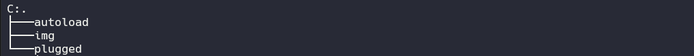

# Get Started

⚙️ Basic configuration for programming microcontrollers that can be used in mechatronic engineering.

<p align="center">

 

</p>


## Table of contents

- [Requirements](#⚡️-requirements)
- [Installation](#🛠️-installation)
- [Keymaps](#⌨️-keymaps)
- [Configuration](#⚙️-configuration)
- [Plugins](#📦-plugins-list)

## ⚡️ Requirements

- Neovim >= 0.7
- a Nerd Font(v3.0 or greater) (optional, but needed to display some icons)
- Node >= 19.8.8
- A C compiler in your path and libstdc++ installed ([Windows users please read this!](https://github.com/nvim-treesitter/nvim-treesitter/wiki/Windows-support)).
- Properly configured Neovim LSP client
- Python 3.11

## 🛠️ Installation

You can start with the configuration as follows:

<details>
<summary>Windows</summary>
  Install configuration with <a href="https://github.com/PowerShell/PowerShell" target="_blank" rel="noopener noreferrer">Poweshell</a>

1. In the terminal,

   ```
   git clone https://github.com/IlReSenzaNome/nvim.git $env:LOCALAPPDATA\nvim
   ```

2. Reload the terminal and launch nvim,

   ```
   nvim $env:LOCALAPPDATA\nvim\init.vim
   ```

3. Use the following command in nvim :PlugInstall,

4. Install additional dependencies for configuration,

   <details>
   <summary>Dependencies</summary>

   ```
   python pip -r requirements.txt
   ```

   On linux and macOs, you can install the [fd-find](https://npm.im/fd-find) package:

   ```
   npm install -g fd-find
   ```

   On windows using dependencies, you ca install the ripgrep

   ```
   winget install BurntSushi.ripgrep.MSVC
   ```

   </details>

</details>

<details>
<summary>Linux/MacOS</summary>

1. In the terminal,

   ```
   git clone https://github.com/IlReSenzaNome/nvim.git ~/.config/nvim
   ```

2. Reload the terminal and launch nvim,

   ```
   nvim ~/.config/nvim/init.vim
   ```

3. Use the following command in nvim :PlugInstall,

4. Install additional dependencies for configuration,

   <details>
   <summary>Dependencies</summary>

   ```
   python pip -r requirements.txt
   ```

   On linux and macOs, you can install the [fd-find](https://npm.im/fd-find) package:

   ```
   npm install -g fd-find
   ```

   On windows using dependencies, you ca install the [ripgrep](https://github.com/BurntSushi/ripgrep#installation) In Linux

   ```
   sudo apt-get install ripgrep
   ```

   In MacOS

   ```
   brew install ripgrep
   ```

   </details>

</details>

## ⌨️ Keymaps

This setup uses several key combinations to make the job of using the extensions as easy as possible.

- default <leader> is `,`
- default <localleader> is `\`

### General

| Key     | Description               | Mode |
| ------- | ------------------------- | ---- |
| `<C-H>` | Go back in insert mode    | i    |
| `<C-J>` | Go down in insert mode    | i    |
| `<C-K>` | Go up in insert mode      | i    |
| `<C-L>` | Go forward in insert mode | i    |

### NerdTree

| key    | Description              | Mode  |
| ------ | ------------------------ | ----- |
| `<F2>` | Open the NerdTreeFind    | i,n,v |
| `<F3>` | Close the NerdTreeToggle | i,n,v |

### FlatTErm

| Key     | Description            | Mode  |
| ------- | ---------------------- | ----- |
| `<C-T>` | Create a new FloatTerm | i,n,v |
| `<C-A>` | Preview a FloatTerm    | i,n,v |
| `<C-Q>` | Next FlatTerm          | i,n,v |
| `<C-W>` | Toggle FloatTerm       | i,n,v |

### NerdComment

| key     | Description                | Mode  |
| ------- | -------------------------- | ----- |
| `<C-C>` | create a NerdCommentToggle | i,n,v |

### Telescope

| key          | Description          | Mode  |
| ------------ | -------------------- | ----- |
| `<leader>ff` | Telescope find files | i,n,v |
| `<leader>fg` | Telescope live grep  | i,n,v |
| `<leader>fb` | Telescope buffers    | i,n,v |
| `<leader>fh` | Telescope help tags  | i,n,v |

## ⚙️ Configuration

### 📂 File Structure

You can add your custom plugin specs under nvim/plugged/. All files there will be automatically loaded by vim-plug. For more information, see configuring plugins.



### Colorscheme

```viml
set background=dark
colorscheme tokyonight
colorscheme tokyonight-night
```

### Default settings

```viml
inoremap <C-H> <left>
inoremap <C-J> <down>
inoremap <C-K> <up>
inoremap <C-L> <right>
" Theme configuration
set background=dark
colorscheme tokyonight
colorscheme tokyonight-night
" Lsp
lua << END
require'lspconfig'.pyright.setup{"pyright-langserver", "--stdio"}
require'lspconfig'.ccls.setup{"ccls"}
END

" configuration nerdtree
let NERDTreeQuitOnOpen=1
nnoremap <silent> <F2> :NERDTreeFind<CR>
nnoremap <silent> <F3> :NERDTreeToggle<CR>

" Configuration floaterm example
let g:floaterm_keymap_new    = '<C-T>'
let g:floaterm_keymap_prev   = '<C-A>'
let g:floaterm_keymap_next   = '<C-Q>'
let g:floaterm_keymap_toggle = '<C-W>'

" NerdComments
nnoremap <C-C> <plug>NERDCommenterToggle

" Telescope
" Find files using Telescope command-line sugar.
nnoremap <leader>ff <cmd>Telescope find_files<cr>
nnoremap <leader>fg <cmd>Telescope live_grep<cr>
nnoremap <leader>fb <cmd>Telescope buffers<cr>
nnoremap <leader>fh <cmd>Telescope help_tags<cr>

" Config lualine
lua << END
-- blankline
require("indent_blankline").setup {
    -- for example, context is off by default, use this to turn it on
    space_char_blankline = " ",
    show_current_context = true,
    show_current_context_start = true,
}
-- bufferline
require("bufferline").setup{}
-- trouble settings
require("trouble").setup()
local actions = require("telescope.actions")
local trouble = require("trouble.providers.telescope")

local telescope = require("telescope")

telescope.setup {
  defaults = {
    mappings = {
      i = { ["<c-t>"] = trouble.open_with_trouble },
      n = { ["<c-t>"] = trouble.open_with_trouble },
    },
  },
}

require("lualine").setup {
  options = {
    theme = "tokyonight",
    icons_enabled = true,
  },
  sections = {
    lualine_a = { "mode" },
    lualine_b = { "filename" },
    lualine_c = { "g:coc_status" },
    lualine_x = { "branch" },
    lualine_y = { "encoding" },
    lualine_z = { "location" }
  },
}
END
```

## 📦 Plugins List

- Auto complete pairs
- Tokyo night
- Ident blankline
- Lualine
- Nerdtree
- dev-icons
- web dev-icons
- git-gutter
- tmux navigator
- bufferline
- vorg-md
- float-term
- Polyglot
- coc
- telescope
- treesitter
- lspconfig
- trouble
