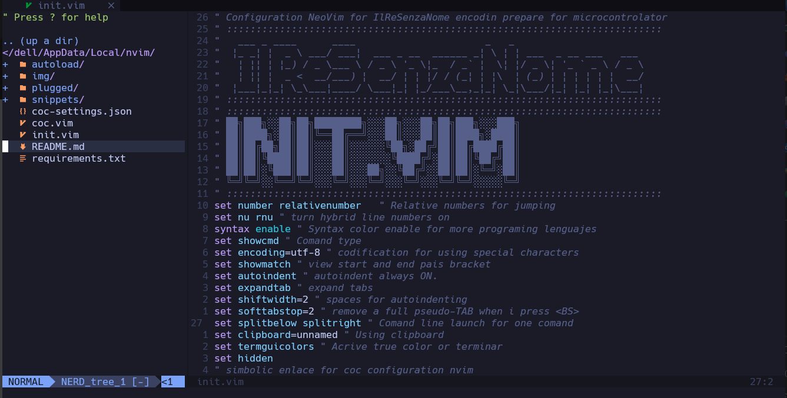

# Get Started

:gear: Basic configuration for programming microcontrollers that can be used in mechatronic engineering.

<div style="display: flex; align-items: center; justify-content: center;">


</div>



## Table of contents

- [Requirements](#⚡️-requirements)
- [Installation](#installation)

## ⚡️ Requirements

- Neovim >= 0.7
- a Nerd Font(v3.0 or greater) (optional, but needed to display some icons)
- Node >= 19.8.8
- A C compiler in your path and libstdc++ installed ([Windows users please read this!](https://github.com/nvim-treesitter/nvim-treesitter/wiki/Windows-support)).
- Properly configured Neovim LSP client

## 🛠️ Installation

:

![]

# Install dependences for plugins

## From python

Instal dependence for coc

```
python pip -r requirements.txt
```

### From npm

On linux and macOS, you can install the [fd-find](https://npm.im/fd-find) package:

```
npm install -g fd-find
```

## From Chocolate

On windows using dependences, you ca install the ripgrep

```
choco install ripgrep
```
